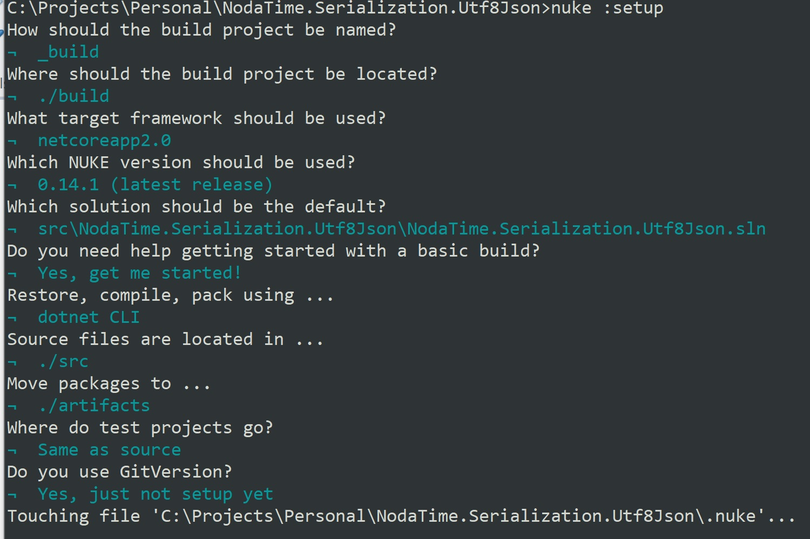

## Getting started
So, you're willing to publish your fist ever super awesome library as nuget package? Worry not, in this guide I will help you 

# Creating a repository
Let's start off by creating a github repository. On github web interface, find New button. From there, enter a new repository name and choose a license (e.g. MIT). Github does not have a default .gitignore for .net projects, so leave it empty for now.

# Starting up your project
Next thing we need to do is cloning the newly created repository. (You may use "git clone {repouri}"). First thing we need to do is creating a .gitignore for our project. The easyest way is just copying the file from another open source project (e.g. https://github.com/aspnet/EntityFrameworkCore/blob/master/.gitignore)
Now we can finally copy the library code to the repository. I prefer to put the source code in a "src" directory, but it's entirely up to you.
For an open source library, you should strongly consider adding SourceLink support https://github.com/dotnet/sourcelink. This allows other developers to debug through your code.

# Versioning
Versioning is very hard! If you are not fancy manually versioning each and every package, I suggest using automated tools for that. The best tool I've been working with is https://gitversion.readthedocs.io/en/latest/. This small command line tool parses the tags and branch information and is capable if incrementing the versions on it's own! It requires zero configuration, but should you really need to adjust some values, you may place a config file to the root of your repository. In the next section, I will show you how to integrate this tool into CI/CD pipeline.

# CI/CD pipeline
I personally think that the whole CI/CD process (outside of CI vendor-specific tasks) should be fully reproducible locally. Therefore, I recommend defining build steps using either Cake s(https://github.com/cake-build/cake) Fake (https://github.com/fsharp/FAKE) or Nuke(https://github.com/nuke-build/nuke). I personally prefer Nuke, for it's incredible integration with IDE and outstanding CLI tools. To get started with NUKE:
- Install nuke global tool (dotnet tool install -g Nuke.GlobalTool)
- From the root folder of your repository, execute "nuke :setup"
- Follow the prompts on the screen
- 
# Nuget publishing
